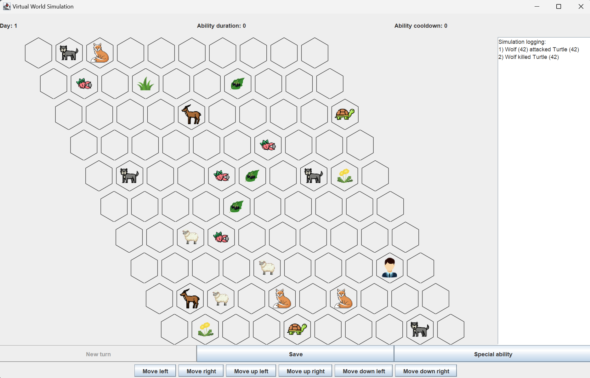

# Virtual World Simulation

A project for college.<br>
Gdańsk University of Technology 2024, object-oriented programming



## Description
The aim of this project is to simulate a virtual world with animals and plants with their special abilities.

### Additional informations

* The order in which the organisms move depends on their initiative - organisms with greater initiative move first, and if the initiative is the same, older organisms move first.
* Animals cannot breed with their parents and siblings.
* When two organisms meet in the same field the stronger organisms kills weaker one. (exceptions below)
* If organisms are of the same type they reproduce.
* Chance of plants spreading: 3%

## Organisms:

| Organism Type | Strength | Initiative | Action | Collision Specific |
| ------------- | ------ | ------ | ------ | ----------------- |
| Wolf          | 9 | 5 | None   | None |
| Sheep         | 4 | 4 | None   | None |
| Turtle        | 2 | 1 | In 75% of cases it will not change its position    | Deflect attacks from organisms with <5 strength |
| Antelope      | 4 | 4 | Movement range is 2 fields | 50% chance to escape from combat |
| Fox           | 3 | 7 | Will never go to the field with stronger organisms   | None |
| Human         | 5 | 4 | Is steering by the player  | When his special ability is activated, he is immortal for 5 rounds |
| Grass | 0 | 0 | None | None |
| Guarana | 0 | 0 | None | Increases animal strength by 3 |
| Milkweed | 0 | 0 | Makes 3 attempts to spread | None |
| Nightshade Berried | 99 | 0 | None | Kills the animal that ate it |
| Sosnowsky Hogweed | 10 | 0 | Kills all the animals in the neighborhood | Kills the animal that ate it | 

## Control

* Arrows - move human
* A - activate human special ability
* S - save

## Saving

Simulation state will be saved as `[SIMULATION_ID]_[TOUR_NUMBER].txt` in the main catalog.

## Compilation and running
```cmake . && make && ./VirtualWorld```

## Operating system

| OS Support | Status |
| ---------- | ------ |
| Linux      | ✅     |
| Windows    | ❌     |
